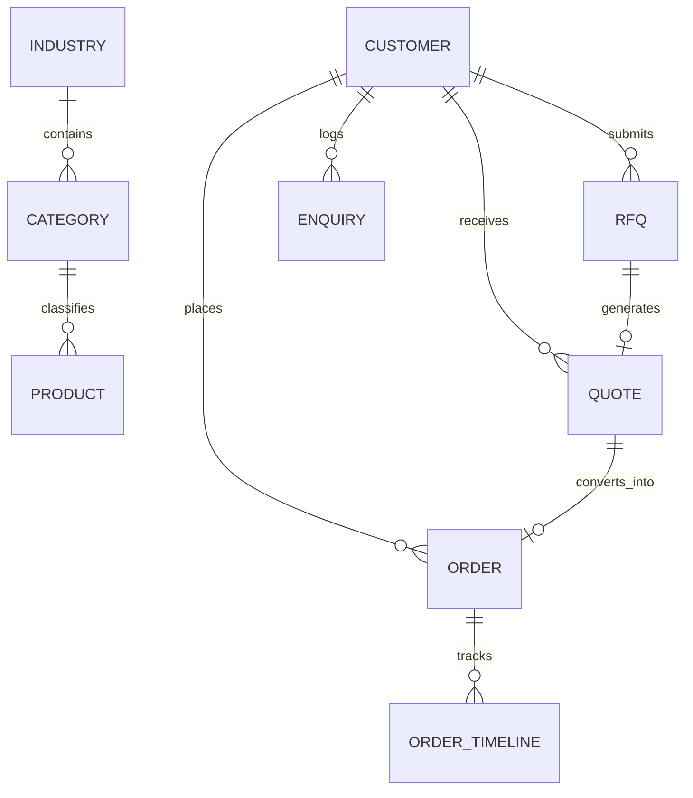

# INDUSTRIA — Data Model & Schema Architecture

## 1. Entity Overview
The platform data model mirrors high-precision industrial manufacturing requirements in India, supporting complete traceability, GST compliance, and technical specifications.



---

## 2. Core TypeScript Interfaces (`lib/types/index.ts`)

### `Product`
```typescript
export interface Product {
  id: string;
  slug: string;
  name: string;
  sku: string;
  category: string;
  industry: string;
  shortDescription: string;
  fullDescription: string;
  images: string[];
  cadAvailable: boolean;
  certifications: string[];
  specifications: { label: string; value: string }[];
  pricingMode: "Contact for Quote" | "Starting At" | "Fixed Price" | "Tiered";
  minOrderQuantity: number;
  unit: string;
  basePrice?: number;
  leadTime: string;
  materials: string[];
  downloads: { title: string; type: string; size: string; filename: string }[];
  faqs: { question: string; answer: string }[];
  status: "Active" | "Draft" | "Archived";
  viewsCount?: number;
  enquiriesCount?: number;
}
```

### `Customer`
```typescript
export interface Customer {
  id: string;
  companyName: string;
  contactPerson: string;
  designation: string;
  phone: string;
  email: string;
  gstNumber: string;
  industry: string;
  city: string;
  state: string;
  website?: string;
  billingAddress: string;
  shippingAddresses: string[];
  ltv: number;
  status: "Active" | "Prospect" | "Inactive";
  accountOwner: string;
  createdAt: string;
}
```

### `RFQ` & `RFQItem`
```typescript
export interface RFQItem {
  productId: string;
  productName: string;
  quantity: number;
  unit: string;
  customSpecs?: string;
}

export interface RFQ {
  id: string;
  rfqNumber: string;
  customerId?: string;
  companyName: string;
  contactPerson: string;
  designation?: string;
  phone: string;
  email: string;
  industry: string;
  items: RFQItem[];
  deliveryLocation: string;
  targetDate: string;
  application?: string;
  budget?: number;
  notes?: string;
  attachedFile?: string;
  status: "Draft" | "Submitted" | "Reviewing" | "Need Information" | "Quoted" | "Won" | "Closed" | "Lost";
  assignedTo: string;
  createdAt: string;
  updatedAt: string;
}
```

### `Quote` & `QuoteLineItem`
```typescript
export interface QuoteLineItem {
  id: string;
  productId: string;
  productName: string;
  sku: string;
  description: string;
  qty: number;
  unitPrice: number;
  discount: number;
  taxPercent: number;
  total: number;
}

export interface Quote {
  id: string;
  quoteNumber: string;
  rfqId?: string;
  rfqNumber?: string;
  customerId: string;
  companyName: string;
  contactPerson: string;
  email: string;
  phone: string;
  issueDate: string;
  expiryDate: string;
  items: QuoteLineItem[];
  subtotal: number;
  discountTotal: number;
  taxTotal: number;
  shippingFee: number;
  grandTotal: number;
  leadTime: string;
  paymentTerms: string;
  deliveryTerms: string;
  notes: string;
  status: "Draft" | "Sent" | "Viewed" | "Accepted" | "Changes Requested" | "Expired" | "Declined";
  createdAt: string;
}
```

### `Order` & `OrderTimelineItem`
```typescript
export interface OrderTimelineItem {
  title: string;
  stage: "Order Placed" | "Confirmed" | "Production" | "Quality Check" | "Ready to Dispatch" | "Dispatched" | "Delivered";
  date: string;
  description: string;
  completed: boolean;
  active?: boolean;
}

export interface Order {
  id: string;
  orderNumber: string;
  quoteId?: string;
  quoteNumber?: string;
  rfqNumber?: string;
  customerId: string;
  companyName: string;
  contactPerson: string;
  phone: string;
  shippingAddress: string;
  items: { productId: string; productName: string; qty: number; unitPrice: number; total: number }[];
  totalAmount: number;
  orderDate: string;
  status: "Pending" | "Confirmed" | "Production" | "Quality" | "Ready" | "Dispatched" | "Delivered" | "Cancelled";
  paymentStatus: "Pending" | "Partial" | "Paid";
  productionStage: string;
  estimatedDelivery: string;
  trackingNumber?: string;
  timeline: OrderTimelineItem[];
}
```
